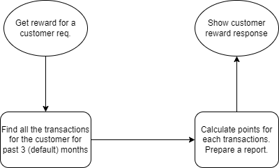
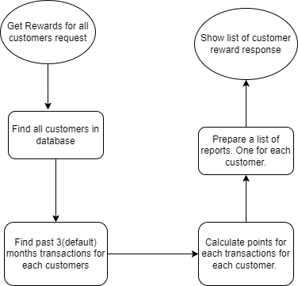

# Retail Reward Service
This service provide a reward programme to the customers, awarding points to the customers based on each transaction for a given time.

A customer receives 2 points for every dollar spent over $100 in each transaction, plus 1 point for every dollar spent between $50 and $100 in each transaction.
(e.g. a $120 purchase = 2*$20 + 1*$50 = 90 Points).

## Technology used:
+ Java 17
+ Springboot 3.3.3
+ Maven
+ H2

## Setup:
1. Create tables customer, transaction.
2. Insert some data.(Examples in evidence folder)
3. Pull the repository and Run.

## Flow Diagram:
#### Get Rewards for a customer:


#### Get Rewards for all customers:


## API Documentation:
1. Get Rewards:
    + URI: "http://localhost:8080/api/rewards?customerId=customer1"
    + Calculate reward points for a customer for each transaction for given amount of time and prepare a report.
    + Response Body:
   ```json
  {
    "customerId": "customer1",
    "monthlyRewards": {
        "2024-JULY": 90,
        "2024-AUGUST": 30
    },
    "customerName": "Karan",
    "totalRewards": 120
  }    
    ```
2. Get Rewards for all customers:
    + URI: "api/getAllCustomerTransaction"
    + Calculate reward points for a customer for each transaction for last three months.
    + Response Body:
    ```json
[
    {
        "customerId": "customer1",
        "name": "Karan",
        "totalRewards": 120,
        "transactions": [
            {
                "transactionId": 1,
                "amount": 120.0,
                "transactionDate": "2024-07-15",
                "points": 90
            },
            {
                "transactionId": 2,
                "amount": 80.0,
                "transactionDate": "2024-08-10",
                "points": 30
            }
        ]
    },
    {
        "customerId": "customer2",
        "name": "Varun",
        "totalRewards": 95,
        "transactions": [
            {
                "transactionId": 3,
                "amount": 55.0,
                "transactionDate": "2024-08-05",
                "points": 5
            },
            {
                "transactionId": 4,
                "amount": 120.0,
                "transactionDate": "2024-09-15",
                "points": 90
            }
        ]
    },
    {
        "customerId": "customer3",
        "name": "Ankit",
        "totalRewards": 6,
        "transactions": [
            {
                "transactionId": 5,
                "amount": 56.0,
                "transactionDate": "2024-06-25",
                "points": 6
            }
        ]
    },
    {
        "customerId": "customer4",
        "name": "Lucky",
        "totalRewards": 10,
        "transactions": [
            {
                "transactionId": 7,
                "amount": 60.0,
                "transactionDate": "2024-07-18",
                "points": 10
            }
        ]
    },
    {
        "customerId": "customer5",
        "name": "Amit",
        "totalRewards": 0,
        "transactions": [
           {
                "transactionId": 8,
                "amount": 45.0,
                "transactionDate": "2024-08-18",
                "points": 0
            }
        ]
    }
]
    ```

